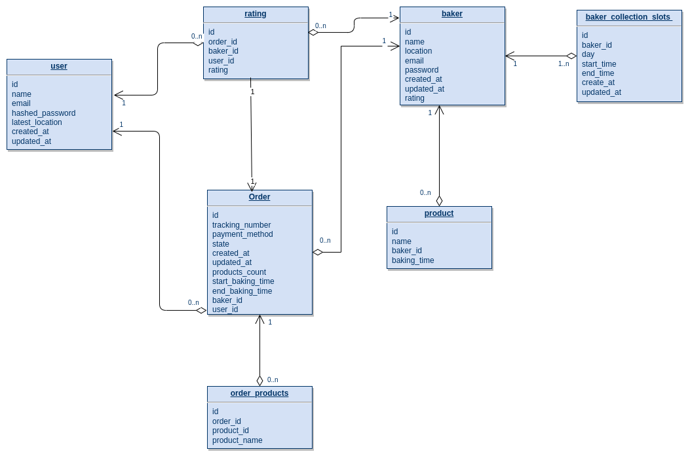
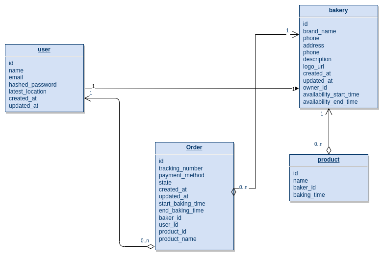
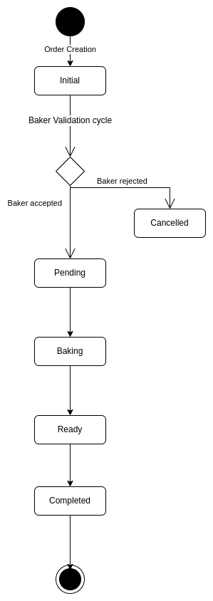

<h1 align="center">
   
  Bake & Connect
   
</h1>

<h4 align="center">A bake and connect application which helps you to bake and others to connect to you built using <a href="https://go.dev" target="_blank">Python</a>, <a href="https://fastapi.tiangolo.com" target="_blank">Fast API</a>, <a href="https://www.mysql.com" target="_blank">MySQL</a>.</h4>

  <a href="#key-features">Key Features</a> •
  <a href="#use-cases">Use Cases</a> •
  <a href="#how-to-use">How To Use</a> •
  <a href="#how-to-run-tests">How To run tests</a> •
  <a href="#implementation-roadmap">Implementation roadmap</a> •
  <a href="#design">Design decisions</a>

## Key Features
- New account registration (either as a Member or as a Baker) and authentication
- Bakers can add new products for selling and then edit or remove them.
- All users can list available products and filter them by location and type.
- All users can see a baker's profile (with a rating).
- Members can see available collection times and place orders.
- Bakers can see their orders, accept, reject, and fulfill them.
- Customers can rate their fulfilled orders. Order rates form the overall baker's rating.

## Use Cases
- Alice loves baking and wants to sell her cherry cakes and kidney pies to others. Alice
created a baker profile at BakeConnect.
- Alice listed her two products. A kidney pie takes 3 hours to bake, and a cherry pie needs 2 hours.
- Assume that at some day, 10:00 in the morning, Bob, Carol and Dan discovered
BakeConnect.
- Bob decides to enjoy a kidney pie and uses BakeConnect to find available kidney pies in
a 2km radius. He finds Alice's offering, registers himself as a member and orders a
kidney pie with the desired collection time of 14:00.
- Carol is a BakeConnect member and wants a cherry pie for lunch. Normally, the earliest
collection time would be 12:00 due to baking time, but Alice is already busy with the
kidney pie from 11:00 until 14:00 (we assume only one cake can be baked at the
moment). Therefore earliest collection time for Carol is 16:00, and she decides to
order a cake for 19:00 and enjoy it at dinner.
- Dan searches for berry cakes and finds Alice's offering. He registers as a member
and puts an order for 16:30 collection time.
At the end of the day, Bob, Carol and Dan rated their orders with 5 stars (of 5),
improving Alice's baker rating.

## How to Use
To be added - Provide instructions on how to use the BakeConnect application. Include details on how to set up the development environment, install dependencies, configure the database connection, and run the application. You can also provide examples of API endpoints and their usage.

## How to Run Tests
To be added - Explain how to run tests for the BakeConnect application. Include information on setting up the test environment, installing test dependencies, and running the test suite. Specify any commands or configurations required to execute the tests successfully.

## Implementation roadmap
Bake & Connect implementation raodmap steps starting from delivering a minimum viable product, Securing the application. After that, shape it into Production.
- [ ] Building Minimum viable product
  - [x] Build core setup (Fast API + MySQL connection)
  - [x] Create user + basic JWT authentication (access token + authenticator)
  - [x] Create bakery
  - [x] Create product
  - [x] Create order using builder pattern
  - [x] Implementing order state flow using state pattern
  - [x] Add all missing GET methods or any other helper method
  - [ ] Handle validations & missing scenarios
- [ ] Securing the application
  - [ ] Completing JWT authentication (Refresh token + forget password)
- [ ] Shaping into Production
  - [x] Use dependency management tool [Poetry](https://python-poetry.org/)
  - [x] Dockerizing the application
  - [ ] Manual deployment on Kubernetes
- [ ] Making development cycle easier
  - [x] Add linting configurations
  - [ ] Covering all modules with unit tests
  - [ ] Adding CI/CD pipeline
  - [ ] Introducing testing environment besides production environment
  - [ ] Any refactoring is needed here?
  - [ ] Adding documentation for all endpoints
- [ ] Adding any feature de-scoped from MVP or enhancement
  - [ ] Rate baker by user
  - [ ] Structure/Scrape the locations data
- [ ] Enhancing some performance?
  - [ ] Caching frequently accessed data, which is the product listing using LFU (least frequently used) algorithm.
- [ ] Making it more secure?
  - [ ] Support authorization using RBAC (role-based access control)
- [ ] More fancy features to come!
  - [ ] Send notifications to customers when their orders are ready!
- [ ] Decided to move to another cloud provider?
  - [ ] Use Terraform to create your Kubernetes cluster and nodes.

## Design decisions
- Initial database design tables using [diagram.io](https://app.diagrams.net). 
- Simplified database design tables to tackle the MVP using [diagram.io](https://app.diagrams.net). 
- State machine for order using [diagram.io](https://app.diagrams.net). 
